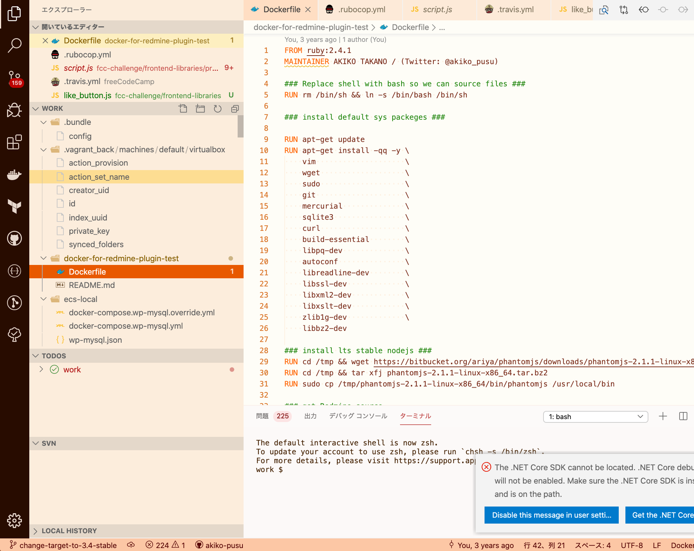

# Coffee Break

Visual Studio Code theme for the coffee break.

This theme was created for the purpose of my learning about Visual Studio Code extensions.

## Overview

## Edit / Customize

- Clone this source.
- Edit ``themes/coffee-break-color-theme.json`` file.
- To test modified colors, press the debug icon and run "Extension" command.
  - Then, the extension development host window will be opened.

## Resources

- [Create a new Color Theme](https://code.visualstudio.com/api/extension-guides/color-theme#create-a-new-color-theme)

## Author

- Akiko Takano (Twitter: @akiko_pusu)
